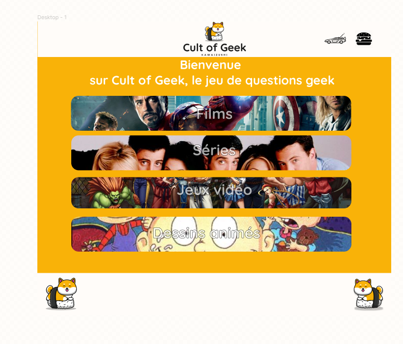

# **CulturePopQuiz - Plateforme de Quiz sur la Culture Pop et Web**

CulturePopQuiz est une plateforme web interactive qui permet aux utilisateurs de tester leurs connaissances en culture populaire et web. Les utilisateurs peuvent participer à des quiz, créer leurs propres quiz personnalisés et les publier, ainsi que consulter et noter les quiz créés par d'autres utilisateurs.

---

## **Table des matières**

- [**Aperçu**](#aperçu)
- [**Fonctionnalités**](#fonctionnalités)
- [**Technologies Utilisées**](#technologies-utilisées)
- [**Installation**](#installation)
- [**Utilisation**](#utilisation)
- [**Contributions**](#contributions)
- [**License**](#license)

---

## **Aperçu**

---

## **Fonctionnalités**

- **Quiz sur la Culture Pop et Web** : Les utilisateurs peuvent participer à une variété de quiz passionnants sur des sujets liés à la culture populaire et web.

- **Création de Quiz Personnalisés** : Les utilisateurs ont la possibilité de créer leurs propres quiz personnalisés en ajoutant des questions, des réponses et des options.

- **Publication de Quiz** : Une fois créés, les quiz peuvent être publiés sur la plateforme pour que d'autres utilisateurs puissent les découvrir et les jouer.

- **Consultation et Notation de Quiz** : Les utilisateurs peuvent parcourir les quiz publiés par d'autres utilisateurs, les jouer et leur attribuer des notes.

---

## **Technologies Utilisées**

- **React** : La plateforme est développée en utilisant la bibliothèque JavaScript React pour une expérience utilisateur interactive et réactive.

- **Firebase** : Firebase est utilisé pour stocker et gérer les quiz créés par les utilisateurs, ainsi que pour gérer l'authentification.

- **SASS** : Les styles sont mis en forme à l'aide de CSS pour une interface utilisateur attrayante et conviviale.

---

## **Utilisation**

1. Inscrivez-vous ou connectez-vous à l'application.
2. Parcourez les quiz existants et jouez-y.
3. Créez votre propre quiz en cliquant sur "Créer un Quiz" et suivez les instructions.
4. Publiez votre quiz pour que d'autres utilisateurs puissent le découvrir et le noter.
5. Explorez les quiz publiés par d'autres utilisateurs et attribuez-leur des notes.
6. Profitez de l'apprentissage et de l'amusement en testant vos connaissances en culture pop et web !

---

## **Contributions**

Les contributions à ce projet sont les bienvenues ! Si vous souhaitez contribuer, veuillez suivre ces étapes :

1. Fork du projet
2. Créez une branche pour vos modifications (`git checkout -b fonctionnalité/nouvelle-fonctionnalité`)
3. Commit de vos modifications (`git commit -m 'Ajout de la nouvelle fonctionnalité'`)
4. Push de la branche (`git push origin fonctionnalité/nouvelle-fonctionnalité`)
5. Ouvrez une Pull Request

---

## **License**

Ce projet est sous licence MIT. Veuillez consulter le fichier [LICENSE](LICENSE) pour plus de détails.

---

N'hésitez pas à personnaliser davantage ce README en fonction de votre projet. Les titres en gras et les lignes horizontales rendent la structure du document plus claire et facile à parcourir. Bonne continuation avec votre projet CulturePopQuiz !